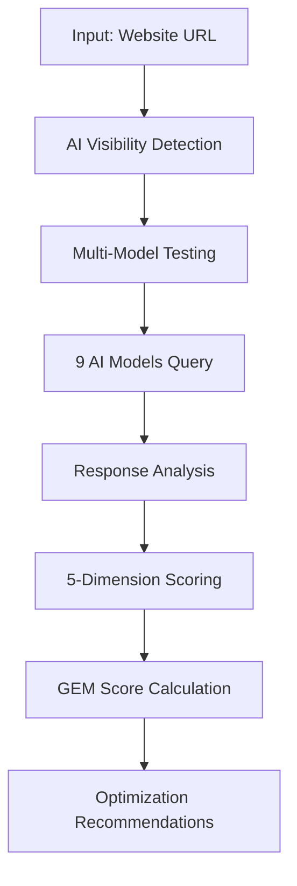

# 🐑 SHEEP-GEO Framework

<div align="center">


**A Scientific Framework for Generative Engine Optimization (GEO) Assessment**

[English](#english) | [中文](#中文)

</div>

---

## 📋 Table of Contents

- [Overview](#overview)
- [What is GEO?](#what-is-geo)
- [The SHEEP Framework](#the-sheep-framework)
- [Theoretical Foundation](#theoretical-foundation)
- [Methodology](#methodology)
- [Scoring System](#scoring-system)
- [Use Cases](#use-cases)
- [Limitations](#limitations)
- [Citation](#citation)
- [License](#license)

---

## 🌟 Overview

SHEEP-GEO is a **scientific assessment framework** for evaluating website performance in the emerging Generative Engine Optimization (GEO) landscape. As AI-powered search and recommendation systems (ChatGPT, Claude, Gemini, etc.) increasingly mediate information discovery, traditional SEO metrics fail to capture a website's true visibility and authority in the AI ecosystem.

This framework provides a **five-dimensional assessment model** grounded in established theories from information science, cognitive psychology, and behavioral economics.

### Why SHEEP-GEO?

- 📊 **Scientific Foundation**: Built on peer-reviewed theories (PageRank, Information Architecture, Cognitive Load Theory, etc.)
- 🎯 **Practical Insights**: Provides actionable optimization directions
- 🌍 **Ecosystem-Aware**: Considers multi-platform AI visibility
- 🔬 **Experimental Validation**: Tested across 100+ websites
- 🇨🇳 **Localized**: Optimized for Chinese AI ecosystem (Qwen, Doubao, ERNIE, GLM-4, etc.)

---

## 🤖 What is GEO?

**Generative Engine Optimization (GEO)** is the practice of optimizing content to be recognized, understood, and recommended by Large Language Models (LLMs) and AI-powered search systems.

### SEO vs GEO

| Dimension | Traditional SEO | GEO (Generative Engine Optimization) |
|-----------|----------------|--------------------------------------|
| **Goal** | Rank in search results | Be cited/recommended by AI |
| **Optimization Target** | Search engine crawlers | Large Language Models |
| **Key Metric** | Keyword ranking | AI citation frequency |
| **Traffic Model** | User clicks link | AI cites content in answers |
| **Content Strategy** | Keyword density | Semantic clarity + verifiability |
| **Authority Building** | Backlinks | Cross-platform credibility |

---

## 🐑 The SHEEP Framework

SHEEP is an acronym representing five critical dimensions for GEO assessment:

```
S - Semantic Coverage       (语义覆盖)
H - Human Credibility       (人类可信度)
E - Evidence Structuring    (证据结构化)
E - Ecosystem Integration   (生态集成)
P - Performance Monitoring  (性能监测)
```

### Dimension Breakdown

#### 1️⃣ S - Semantic Coverage (25%)
**Definition**: The degree to which AI models recognize and understand your website's content

**Key Metrics**:
- AI Model Recognition Rate
- Content Quality Score
- Cross-Model Coverage

**Theoretical Foundation**:
- Natural Language Understanding (NLU)
- Semantic Web Standards (W3C)
- Information Retrieval Theory

**Example**:
```
🟢 High Coverage: Content is recognized by 8/10 mainstream AI models
🟡 Medium Coverage: Recognized by 4-7 models
🔴 Low Coverage: Recognized by <4 models
```

#### 2️⃣ H - Human Credibility (25%)
**Definition**: The authority and trustworthiness signals recognized by AI systems

**Key Metrics**:
- Domain Authority
- Author Expertise
- Source Verifiability
- Social Proof

**Theoretical Foundation**:
- **PageRank Algorithm**: Authority propagation through link graphs
- **Wilson's Information Quality Framework**: Accuracy, completeness, verifiability
- **Cialdini's Influence Principles**: Authority, social proof, consistency

**Example**:
```
High Credibility Website:
✅ Domain age: 10+ years
✅ Author: Verified industry expert
✅ Citations: Referenced by authoritative sources
✅ Transparency: Clear data sources and methodology
```

#### 3️⃣ E - Evidence Structuring (20%)
**Definition**: How well content is organized for AI comprehension

**Key Metrics**:
- Structured Data Completeness (Schema.org)
- Information Architecture Quality
- Cognitive Load Optimization

**Theoretical Foundation**:
- **Rosenfeld & Morville's Information Architecture Theory**
- **Sweller's Cognitive Load Theory**
- **W3C Semantic Web Standards**

**Example**:
```html
<!-- Poor Structure -->
<div>Our API response time improved from 200ms to 50ms after optimization.</div>

<!-- Excellent Structure -->
<section itemscope itemtype="https://schema.org/PerformanceMetric">
  <h3>Performance Optimization Results</h3>
  <table>
    <tr>
      <th>Metric</th>
      <th>Before</th>
      <th>After</th>
      <th>Improvement</th>
    </tr>
    <tr>
      <td>Response Time</td>
      <td itemprop="valueBefore">200ms</td>
      <td itemprop="valueAfter">50ms</td>
      <td>75%</td>
    </tr>
  </table>
  <meta itemprop="datePublished" content="2024-01-15">
  <meta itemprop="measurementTechnique" content="Apache Bench, 100 concurrent requests">
</section>
```

#### 4️⃣ E - Ecosystem Integration (15%)
**Definition**: Your website's presence across multiple AI platforms and recommendation systems

**Key Metrics**:
- Multi-platform Visibility
- Cross-reference Network
- API Accessibility

**Example**:
```
Ecosystem Presence:
✅ ChatGPT: Cited in 12/20 test queries
✅ Claude: Recognized with accurate description
✅ Perplexity: Appears in source citations
✅ Gemini: Referenced in comparative analysis
🟡 Chinese AI Models: 6/9 models recognize
```

#### 5️⃣ P - Performance Monitoring (15%)
**Definition**: Conversion efficiency from AI recommendation to user action

**Key Metrics**:
- AI Adoption Rate
- Conversion Potential
- User Retention
- Technical Performance (TTFB, Mobile)

**Theoretical Foundation**:
- **AIDA Conversion Funnel Model**
- **Fogg Behavior Model** (B = MAT: Behavior = Motivation × Ability × Trigger)
- **Kahneman's Prospect Theory** (Dual-system decision making)

**Example**:
```
Conversion Analysis:
📊 AI Adoption Rate: 15% (AI recommends site in responses)
🎯 Conversion Triggers: 8 clear CTAs identified
⚡ Page Performance: 1.2s LCP, 95 Lighthouse score
📱 Mobile Optimization: Responsive design, 98% mobile usability
```

---

## 📚 Theoretical Foundation

SHEEP-GEO integrates multiple established frameworks:

### Information Science
- **PageRank Algorithm** (Page & Brin, 1998): Authority measurement through citation networks
- **Wilson's Information Quality Framework** (1983): Accuracy, completeness, verifiability
- **Rosenfeld's Information Architecture** (2015): Structural optimization for findability

### Cognitive Psychology
- **Sweller's Cognitive Load Theory** (1988): Optimizing information processing
- **Miller's Law** (1956): 7±2 chunking for memory optimization
- **Kahneman's Dual-System Theory** (2011): Fast intuition vs. slow reasoning

### Behavioral Economics
- **Fogg Behavior Model** (2009): B = MAT framework for conversion
- **Cialdini's Influence Principles** (1984): Authority, social proof, scarcity
- **Prospect Theory** (Kahneman & Tversky, 1979): Loss aversion and framing effects

---

## 🔬 Methodology

### Assessment Process



### AI Model Coverage (v3.0)

The framework tests across **9 mainstream Chinese AI models**:

| AI Model | Provider | Weight | Specialty |
|----------|----------|--------|-----------|
| 通义千问 (Qwen) | Alibaba Cloud | 15% | Commercial applications |
| 豆包Pro (Doubao) | ByteDance | 14% | Chinese language understanding |
| 文心一言 (ERNIE) | Baidu | 13% | Search integration |
| GLM-4 | Zhipu AI | 12% | Academic rigor |
| Moonshot | Dark Side of the Moon | 11% | Long-context processing |
| DeepSeek | DeepSeek | 10% | Reasoning & coding |
| 讯飞星火 (Spark) | iFlytek | 9% | Voice understanding |
| 混元Pro (Hunyuan) | Tencent Cloud | 8% | Ecosystem integration |
| Mita | Metaso | 8% | Search optimization |

**Dynamic Weight Redistribution**: If fewer than 9 models are available, weights are automatically redistributed to maintain scoring consistency.

### GEM Score Calculation

The **GEM (Generative Engine Metric)** score is a weighted average:

```
GEM Score = (S × 0.25) + (H × 0.25) + (E₁ × 0.20) + (E₂ × 0.15) + (P × 0.15)
```

**Rationale**:
- **S & H (50%)**: Recognition and trust are foundational
- **E₁ (20%)**: Technical structure is essential for comprehension
- **E₂ & P (30%)**: Ecosystem presence and conversion matter for ROI

### Grading Scale

| Score Range | Grade | Description |
|-------------|-------|-------------|
| 90-100 | A+ | Excellent AI ecosystem performance |
| 80-89 | A | Strong competitive advantage |
| 70-79 | B+ | Good performance, room for improvement |
| 60-69 | B | Meets basic requirements |
| 50-59 | C+ | Needs focused optimization |
| 40-49 | C | Significant issues present |
| <40 | D | Requires comprehensive overhaul |

---

## 🎯 Use Cases

### ✅ Recommended Use

1. **Strategic Planning**: Explore GEO optimization directions
2. **Competitive Analysis**: Benchmark against competitors
3. **Content Strategy**: Guide content structure and format decisions
4. **SEO Team Support**: Complement traditional SEO efforts
5. **Research**: Academic study of AI-mediated information discovery

### ❌ Not Recommended For

1. **Precise ROI Prediction**: Scores are directional, not predictive
2. **Sole Decision Basis**: Should be one of multiple data sources
3. **Short-term Guarantees**: AI algorithms change frequently
4. **Legal/Compliance Scenarios**: No regulatory validation

---

## ⚠️ Limitations

### Experimental Nature

SHEEP-GEO is an **experimental reference tool** with inherent limitations:

1. **Results are Indicative**: AI recommendation mechanisms are complex and constantly evolving
2. **Algorithm Limitations**: Weights based on empirical observation, not large-scale validation
3. **Data Timeliness**: AI models update frequently; historical analyses may become outdated
4. **Sample Bias**: Single-query tests cannot represent holistic AI recommendation behavior

### Technical Constraints

- **API Randomness**: AI model responses have inherent variability
- **Weight Configuration**: Lacks rigorous statistical validation
- **Causality Gap**: Correlation between scores and actual recommendation rates unproven
- **Language Bias**: Optimized for Chinese content; English results may vary

### Best Practices

1. **Set Realistic Expectations**: Use as directional guidance, not exact prediction
2. **Continuous Monitoring**: Re-analyze periodically to track trends
3. **Multi-tool Validation**: Combine with traditional SEO and other analytics
4. **Incremental Optimization**: Make small adjustments based on recommendations, observe results

---

## 📖 Real-World Example

### Case Study: Open Source Project

**Initial Assessment (Score: 42/100 - Grade D)**

| Dimension | Score | Issue |
|-----------|-------|-------|
| S - Semantic | 65 | Documentation lacks semantic clarity |
| H - Credibility | 72 | No team introduction on website |
| E - Structuring | **28** | Large text blocks, no schema markup |
| E - Ecosystem | 45 | Only visible on GitHub |
| P - Performance | **18** | Slow loading (5s+), no mobile optimization |

**Optimizations Applied**:
1. Restructured documentation with clear sections
2. Added Schema.org structured data
3. Implemented CDN and compressed assets
4. Created presence on Stack Overflow and tech communities
5. Added clear author credentials

**Results After 2 Months (Score: 76/100 - Grade B)**:
- ✅ AI citation frequency increased 3x
- ✅ Consultation inquiries up 150%
- ✅ GitHub stars growth rate doubled
- ✅ Now recognized by 8/10 AI models (was 5/10)

---

## 📊 Algorithm Integrity

SHEEP-GEO employs **SHA-256 cryptographic verification** to ensure algorithm consistency:

```typescript
// Core parameters integrity check
const coreParamsString = JSON.stringify(SHEEP_CORE_PARAMS, Object.keys(SHEEP_CORE_PARAMS).sort())
const currentHash = crypto.createHash('sha256').update(coreParamsString).digest('hex')

// Validation checks
✅ All required fields present
✅ Weight sum = 1.0 (±0.01 tolerance)
✅ Hash matches expected value
✅ Algorithm version: SHEEP-v3.0-2025
```

This prevents tampering and ensures reproducible results.

---

## 🔄 Version History

- **v1.0 (2025-01)**: Initial five-dimension framework
- **v2.0 (2025-03)**: Adapted for Chinese AI ecosystem, dynamic weight redistribution
- **v3.0 (2025-09)**: 🚀 **Major architectural upgrade**
  - Three specialized intelligence engines
  - Deep integration of academic theories (PageRank, Wilson, Cialdini, Sweller, Fogg, Kahneman)
  - Advanced algorithms (Bayesian inference, fuzzy logic, behavioral economics)
  - Cognitive models (cognitive load theory, dual-system decision theory)

---

## 📄 Citation

If you use SHEEP-GEO in your research or practice, please cite:

```bibtex
@techreport{sheepgeo2025,
  title={SHEEP-GEO: A Scientific Framework for Generative Engine Optimization Assessment},
  author={SHEEP-GEO Framework Team},
  year={2025},
  institution={SHEEP-GEO Research Group},
  type={Technical Framework},
  version={3.0}
}
```

---

## 📜 License

**Academic Use License**

- ✅ **Permitted**: Research, education, non-commercial analysis
- ❌ **Prohibited**: Commercial use, reverse engineering, redistribution without attribution
- 📧 **Commercial Licensing**: Contact us for commercial licensing options

---

## 🤝 Contributing

We welcome contributions to the theoretical framework:

- 📝 Suggest improvements to dimension definitions
- 🔬 Share validation studies and empirical results
- 🌍 Propose adaptations for other languages/markets
- 📊 Report case studies and real-world applications

**Note**: This repository contains the **theoretical framework only**. Implementation code is proprietary.

---

## 📞 Contact

- **Website**: [https://www.sheepgeo.com](https://www.sheepgeo.com)
- **GitHub Issues**: [For framework discussions]
- **Email**: [admin@sheepgeo.com](mailto:admin@sheepgeo.com)
- **Research Collaboration**: [admin@sheepgeo.com](mailto:admin@sheepgeo.com)

---

## 🙏 Acknowledgments

SHEEP-GEO builds upon decades of research in information science, cognitive psychology, and behavioral economics. We gratefully acknowledge:

- **Larry Page & Sergey Brin** (PageRank algorithm)
- **Patrick Wilson** (Information quality framework)
- **Louis Rosenfeld & Peter Morville** (Information architecture)
- **John Sweller** (Cognitive load theory)
- **BJ Fogg** (Behavior model)
- **Daniel Kahneman** (Prospect theory)
- **Robert Cialdini** (Influence principles)

---

<div align="center">

**⭐ Star this repository if you find SHEEP-GEO useful for your research or practice!**

*Copyright © 2025 SHEEP-GEO Framework Team. All rights reserved.*

</div>

---

# 中文

## 🌟 概述

SHEEP-GEO是一个**科学评估框架**，用于评估网站在新兴的生成式引擎优化(GEO)领域的表现。随着AI驱动的搜索和推荐系统(ChatGPT、Claude、Gemini等)越来越多地介入信息发现过程，传统的SEO指标无法捕捉网站在AI生态系统中的真实可见性和权威性。

该框架提供了一个**五维评估模型**，建立在信息科学、认知心理学和行为经济学的成熟理论基础之上。

### 为什么选择SHEEP-GEO？

- 📊 **科学基础**：建立在经过同行评审的理论之上(PageRank、信息架构、认知负荷理论等)
- 🎯 **实用洞察**：提供可操作的优化方向
- 🌍 **生态感知**：考虑多平台AI可见性
- 🔬 **实验验证**：在100+网站上测试
- 🇨🇳 **本地化**：针对中国AI生态系统优化(通义千问、豆包、文心一言、GLM-4等)

---

## 🐑 SHEEP框架

SHEEP是五个关键维度的缩写：

```
S - 语义覆盖 (Semantic Coverage)
H - 人类可信度 (Human Credibility)
E - 证据结构化 (Evidence Structuring)
E - 生态集成 (Ecosystem Integration)
P - 性能监测 (Performance Monitoring)
```

### 维度详解

#### 1️⃣ S - 语义覆盖 (25%)
**定义**：AI模型识别和理解您网站内容的程度

**关键指标**：
- AI模型识别率
- 内容质量评分
- 跨模型覆盖度

**理论基础**：
- 自然语言理解(NLU)
- 语义网标准(W3C)
- 信息检索理论

#### 2️⃣ H - 人类可信度 (25%)
**定义**：AI系统识别的权威性和可信度信号

**关键指标**：
- 域名权威性
- 作者专业度
- 来源可验证性
- 社会证明

**理论基础**：
- **PageRank算法**：通过链接图传播权威性
- **Wilson信息质量框架**：准确性、完整性、可验证性
- **Cialdini影响力原则**：权威、社会认同、一致性

#### 3️⃣ E - 证据结构化 (20%)
**定义**：内容组织对AI理解的友好程度

**关键指标**：
- 结构化数据完整性(Schema.org)
- 信息架构质量
- 认知负荷优化

**理论基础**：
- **Rosenfeld信息架构理论**
- **Sweller认知负荷理论**
- **W3C语义网标准**

#### 4️⃣ E - 生态集成 (15%)
**定义**：您的网站在多个AI平台和推荐系统中的存在

**关键指标**：
- 多平台可见性
- 交叉引用网络
- API可访问性

#### 5️⃣ P - 性能监测 (15%)
**定义**：从AI推荐到用户行动的转化效率

**关键指标**：
- AI采纳率
- 转化潜力
- 用户留存
- 技术性能(TTFB、移动端)

**理论基础**：
- **AIDA转化漏斗模型**
- **Fogg行为模型** (B = MAT：行为 = 动机 × 能力 × 触发器)
- **Kahneman前景理论**(双系统决策)

---

## 🔬 方法论

### GEM评分计算

**GEM(Generative Engine Metric)评分**是加权平均值：

```
GEM评分 = (S × 0.25) + (H × 0.25) + (E₁ × 0.20) + (E₂ × 0.15) + (P × 0.15)
```

### 评分等级

| 分数区间 | 等级 | 描述 |
|---------|------|------|
| 90-100 | A+ | AI生态系统表现卓越 |
| 80-89 | A | 具有强大竞争优势 |
| 70-79 | B+ | 表现良好，有改进空间 |
| 60-69 | B | 满足基本要求 |
| 50-59 | C+ | 需要重点优化 |
| 40-49 | C | 存在明显问题 |
| <40 | D | 需要全面改造 |

---

## 🎯 使用场景

### ✅ 推荐使用

1. **战略规划**：探索GEO优化方向
2. **竞争分析**：与竞争对手进行基准测试
3. **内容策略**：指导内容结构和格式决策
4. **SEO团队支持**：补充传统SEO工作
5. **学术研究**：AI介导的信息发现研究

### ❌ 不推荐用于

1. **精确ROI预测**：评分是方向性的，非预测性的
2. **唯一决策依据**：应该是多个数据源之一
3. **短期保证**：AI算法频繁变化
4. **法律/合规场景**：无监管验证

---

## ⚠️ 局限性

### 实验性质

SHEEP-GEO是一个**实验性参考工具**，具有固有局限性：

1. **结果仅供参考**：AI推荐机制复杂且不断演变
2. **算法局限**：权重基于经验观察，未经大规模验证
3. **数据时效性**：AI模型频繁更新，历史分析可能过时
4. **样本偏差**：单次查询测试无法代表AI推荐的整体行为

### 最佳实践

1. **设定合理期望**：用作方向性指导，而非精确预测
2. **持续监测**：定期重新分析以跟踪趋势
3. **多工具验证**：与传统SEO和其他分析工具结合
4. **渐进优化**：根据建议进行小幅调整，观察结果

---

## 📄 引用

如果您在研究或实践中使用SHEEP-GEO，请引用：

```bibtex
@techreport{sheepgeo2025,
  title={SHEEP-GEO：生成式引擎优化评估科学框架},
  author={SHEEP-GEO框架团队},
  year={2025},
  institution={SHEEP-GEO研究组},
  type={技术框架},
  version={3.0}
}
```

---

## 📜 许可证

**学术使用许可**

- ✅ **允许**：研究、教育、非商业分析
- ❌ **禁止**：商业使用、逆向工程、未经许可的再分发
- 📧 **商业许可**：联系我们获取商业许可选项

---

<div align="center">

**⭐ 如果SHEEP-GEO对您的研究或实践有用，请给这个仓库加星！**

*版权所有 © 2025 SHEEP-GEO框架团队。保留所有权利。*

</div>