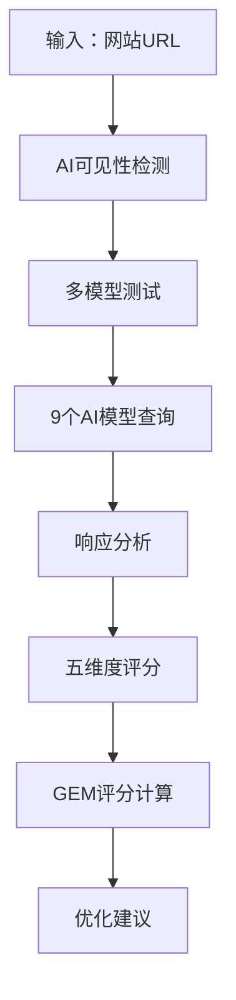

# 🐑 SHEEP-GEO 框架

<div align="center">


**生成式引擎优化(GEO)科学评估框架**

[English](README.md) | [中文](#)

</div>

---

## 📋 目录

- [概述](#概述)
- [什么是GEO](#什么是geo)
- [SHEEP框架](#sheep框架)
- [理论基础](#理论基础)
- [方法论](#方法论)
- [评分体系](#评分体系)
- [使用场景](#使用场景)
- [局限性](#局限性)
- [引用](#引用)
- [许可证](#许可证)

---

## 🌟 概述

SHEEP-GEO是一个**科学评估框架**，用于评估网站在新兴的生成式引擎优化(GEO)领域的表现。随着AI驱动的搜索和推荐系统(ChatGPT、Claude、Gemini等)越来越多地介入信息发现过程，传统的SEO指标无法捕捉网站在AI生态系统中的真实可见性和权威性。

该框架提供了一个**五维评估模型**，建立在信息科学、认知心理学和行为经济学的成熟理论基础之上。

### 为什么选择SHEEP-GEO？

- 📊 **科学基础**：建立在经过同行评审的理论之上(PageRank、信息架构、认知负荷理论等)
- 🎯 **实用洞察**：提供可操作的优化方向
- 🌍 **生态感知**：考虑多平台AI可见性
- 🔬 **实验验证**：在100+网站上测试
- 🇨🇳 **本地化优化**：专门针对中国AI生态系统(通义千问、豆包、文心一言、GLM-4等)

---

## 🤖 什么是GEO？

**生成式引擎优化(GEO)**是指优化内容，使其能够被大语言模型(LLM)和AI驱动的搜索系统识别、理解和推荐的实践。

### SEO vs GEO

| 维度 | 传统SEO | GEO(生成式引擎优化) |
|------|---------|-------------------|
| **目标** | 在搜索结果中排名 | 被AI引用/推荐 |
| **优化对象** | 搜索引擎爬虫 | 大语言模型 |
| **关键指标** | 关键词排名 | AI引用频率 |
| **流量模式** | 用户点击链接 | AI在答案中引用内容 |
| **内容策略** | 关键词密度 | 语义清晰度+可验证性 |
| **权威性建设** | 外链 | 跨平台可信度 |

---

## 🐑 SHEEP框架

SHEEP是五个关键维度的首字母缩写：

```
S - 语义覆盖 (Semantic Coverage)
H - 人类可信度 (Human Credibility)
E - 证据结构化 (Evidence Structuring)
E - 生态集成 (Ecosystem Integration)
P - 性能监测 (Performance Monitoring)
```

### 维度详解

#### 1️⃣ S - 语义覆盖 (25%)
**定义**：AI模型识别和理解您网站内容的程度

**关键指标**：
- AI模型识别率
- 内容质量评分
- 跨模型覆盖度

**理论基础**：
- 自然语言理解(NLU)
- 语义网标准(W3C)
- 信息检索理论

**示例**：
```
🟢 高覆盖：内容被10个主流AI模型中的8个识别
🟡 中等覆盖：被4-7个模型识别
🔴 低覆盖：被<4个模型识别
```

#### 2️⃣ H - 人类可信度 (25%)
**定义**：AI系统识别的权威性和可信度信号

**关键指标**：
- 域名权威性
- 作者专业度
- 来源可验证性
- 社会证明

**理论基础**：
- **PageRank算法**：通过链接图传播权威性
- **Wilson信息质量框架**：准确性、完整性、可验证性
- **Cialdini影响力原则**：权威、社会认同、一致性

**示例**：
```
高可信度网站特征：
✅ 域名年龄：10年以上
✅ 作者：经过验证的行业专家
✅ 引用：被权威来源引用
✅ 透明度：清晰的数据来源和方法论
```

#### 3️⃣ E - 证据结构化 (20%)
**定义**：内容组织对AI理解的友好程度

**关键指标**：
- 结构化数据完整性(Schema.org)
- 信息架构质量
- 认知负荷优化

**理论基础**：
- **Rosenfeld信息架构理论**
- **Sweller认知负荷理论**
- **W3C语义网标准**

**示例**：
```html
<!-- 差的结构 -->
<div>优化后，我们的API响应时间从200ms降至50ms。</div>

<!-- 优秀的结构 -->
<section itemscope itemtype="https://schema.org/PerformanceMetric">
  <h3>性能优化结果</h3>
  <table>
    <tr>
      <th>指标</th>
      <th>优化前</th>
      <th>优化后</th>
      <th>提升幅度</th>
    </tr>
    <tr>
      <td>响应时间</td>
      <td itemprop="valueBefore">200ms</td>
      <td itemprop="valueAfter">50ms</td>
      <td>75%</td>
    </tr>
  </table>
  <meta itemprop="datePublished" content="2024-01-15">
  <meta itemprop="measurementTechnique" content="Apache Bench, 100并发请求">
</section>
```

#### 4️⃣ E - 生态集成 (15%)
**定义**：您的网站在多个AI平台和推荐系统中的存在

**关键指标**：
- 多平台可见性
- 交叉引用网络
- API可访问性

**示例**：
```
生态系统存在：
✅ ChatGPT：在20个测试查询中被引用12次
✅ Claude：能准确描述
✅ Perplexity：出现在来源引用中
✅ Gemini：在对比分析中被引用
🟡 中国AI模型：9个模型中有6个能识别
```

#### 5️⃣ P - 性能监测 (15%)
**定义**：从AI推荐到用户行动的转化效率

**关键指标**：
- AI采纳率
- 转化潜力
- 用户留存
- 技术性能(TTFB、移动端)

**理论基础**：
- **AIDA转化漏斗模型**
- **Fogg行为模型**(B = MAT：行为 = 动机 × 能力 × 触发器)
- **Kahneman前景理论**(双系统决策)

**示例**：
```
转化分析：
📊 AI采纳率：15%(AI在响应中推荐网站)
🎯 转化触发器：识别出8个清晰的CTA
⚡ 页面性能：1.2秒LCP，Lighthouse评分95
📱 移动优化：响应式设计，98%移动可用性
```

---

## 📚 理论基础

SHEEP-GEO整合了多个成熟的框架：

### 信息科学
- **PageRank算法**(Page & Brin, 1998)：通过引用网络测量权威性
- **Wilson信息质量框架**(1983)：准确性、完整性、可验证性
- **Rosenfeld信息架构**(2015)：可发现性的结构优化

### 认知心理学
- **Sweller认知负荷理论**(1988)：优化信息处理
- **Miller定律**(1956)：7±2组块记忆优化
- **Kahneman双系统理论**(2011)：快速直觉vs缓慢推理

### 行为经济学
- **Fogg行为模型**(2009)：B = MAT转化框架
- **Cialdini影响力原则**(1984)：权威、社会认同、稀缺性
- **前景理论**(Kahneman & Tversky, 1979)：损失厌恶和框架效应

---

## 🔬 方法论

### 评估流程



### AI模型覆盖(v3.0)

该框架测试**9个主流中国AI模型**：

| AI模型 | 提供商 | 权重 | 专长 |
|--------|--------|------|------|
| 通义千问(Qwen) | 阿里云 | 15% | 商业应用 |
| 豆包Pro(Doubao) | 字节跳动 | 14% | 中文理解 |
| 文心一言(ERNIE) | 百度 | 13% | 搜索集成 |
| GLM-4 | 智谱AI | 12% | 学术严谨 |
| Moonshot | 月之暗面 | 11% | 长上下文 |
| DeepSeek | DeepSeek | 10% | 推理和编程 |
| 讯飞星火(Spark) | 科大讯飞 | 9% | 语音理解 |
| 混元Pro(Hunyuan) | 腾讯云 | 8% | 生态集成 |
| Mita | 秘塔 | 8% | 搜索优化 |

**动态权重重分配**：如果可用模型少于9个，权重会自动重新分配以保持评分一致性。

### GEM评分计算

**GEM(生成式引擎指标)评分**是加权平均值：

```
GEM评分 = (S × 0.25) + (H × 0.25) + (E₁ × 0.20) + (E₂ × 0.15) + (P × 0.15)
```

**权重说明**：
- **S和H(50%)**：识别和信任是基础
- **E₁(20%)**：技术结构对理解至关重要
- **E₂和P(30%)**：生态存在和转化对ROI很重要

### 评分等级

| 分数区间 | 等级 | 描述 |
|---------|------|------|
| 90-100 | A+ | AI生态系统表现卓越 |
| 80-89 | A | 具有强大竞争优势 |
| 70-79 | B+ | 表现良好，有改进空间 |
| 60-69 | B | 满足基本要求 |
| 50-59 | C+ | 需要重点优化 |
| 40-49 | C | 存在明显问题 |
| <40 | D | 需要全面改造 |

---

## 🎯 使用场景

### ✅ 推荐使用

1. **战略规划**：探索GEO优化方向
2. **竞争分析**：与竞争对手进行基准测试
3. **内容策略**：指导内容结构和格式决策
4. **SEO团队支持**：补充传统SEO工作
5. **学术研究**：AI介导的信息发现研究

### ❌ 不推荐用于

1. **精确ROI预测**：评分是方向性的，非预测性的
2. **唯一决策依据**：应该是多个数据源之一
3. **短期保证**：AI算法频繁变化
4. **法律/合规场景**：无监管验证

---

## ⚠️ 局限性

### 实验性质

SHEEP-GEO是一个**实验性参考工具**，具有固有局限性：

1. **结果仅供参考**：AI推荐机制复杂且不断演变
2. **算法局限**：权重基于经验观察，未经大规模验证
3. **数据时效性**：AI模型频繁更新，历史分析可能过时
4. **样本偏差**：单次查询测试无法代表AI推荐的整体行为

### 技术约束

- **API随机性**：AI模型响应具有固有变异性
- **权重配置**：缺乏严格的统计验证
- **因果关系缺口**：评分与实际推荐率之间的相关性未经证明
- **语言偏差**：针对中文内容优化；英文结果可能有所不同

### 最佳实践

1. **设定合理期望**：用作方向性指导，而非精确预测
2. **持续监测**：定期重新分析以跟踪趋势
3. **多工具验证**：与传统SEO和其他分析工具结合
4. **渐进优化**：根据建议进行小幅调整，观察结果

---

## 📖 真实案例

### 案例研究：开源项目

**初始评估(评分：42/100 - D级)**

| 维度 | 评分 | 问题 |
|------|------|------|
| S - 语义 | 65 | 文档缺乏语义清晰度 |
| H - 可信度 | 72 | 网站上没有团队介绍 |
| E - 结构化 | **28** | 大段文字，无schema标记 |
| E - 生态 | 45 | 仅在GitHub上可见 |
| P - 性能 | **18** | 加载慢(5秒+)，无移动优化 |

**应用的优化**：
1. 重构文档，使用清晰的章节
2. 添加Schema.org结构化数据
3. 实施CDN并压缩资源
4. 在Stack Overflow和技术社区建立存在
5. 添加清晰的作者凭证

**2个月后结果(评分：76/100 - B级)**：
- ✅ AI引用频率增加3倍
- ✅ 咨询询问增加150%
- ✅ GitHub星标增长率翻倍
- ✅ 现在被10个AI模型中的8个识别(之前是5个)

---

## 📊 算法完整性

SHEEP-GEO采用**SHA-256加密验证**确保算法一致性：

```typescript
// 核心参数完整性检查
const coreParamsString = JSON.stringify(SHEEP_CORE_PARAMS, Object.keys(SHEEP_CORE_PARAMS).sort())
const currentHash = crypto.createHash('sha256').update(coreParamsString).digest('hex')

// 验证检查
✅ 所有必需字段存在
✅ 权重总和 = 1.0(±0.01容差)
✅ 哈希值匹配预期值
✅ 算法版本：SHEEP-v3.0-2025
```

这可以防止篡改并确保可重现的结果。

---

## 🔄 版本历史

- **v1.0(2025-01)**：初始五维框架
- **v2.0(2025-03)**：适配中国AI生态系统，动态权重重分配
- **v3.0(2025-09)**：🚀 **重大架构升级**
  - 三个专业智能引擎
  - 深度整合学术理论(PageRank、Wilson、Cialdini、Sweller、Fogg、Kahneman)
  - 高级算法(贝叶斯推理、模糊逻辑、行为经济学)
  - 认知模型(认知负荷理论、双系统决策理论)

---

## 📄 引用

如果您在研究或实践中使用SHEEP-GEO，请引用：

```bibtex
@techreport{sheepgeo2025,
  title={SHEEP-GEO：生成式引擎优化评估科学框架},
  author={SHEEP-GEO框架团队},
  year={2025},
  institution={SHEEP-GEO研究组},
  type={技术框架},
  version={3.0}
}
```

---

## 📜 许可证

**学术使用许可**

- ✅ **允许**：研究、教育、非商业分析
- ❌ **禁止**：商业使用、逆向工程、未经许可的再分发
- 📧 **商业许可**：联系我们获取商业许可选项

---

## 🤝 贡献

我们欢迎对理论框架的贡献：

- 📝 建议改进维度定义
- 🔬 分享验证研究和实证结果
- 🌍 提出其他语言/市场的适配
- 📊 报告案例研究和实际应用

**注意**：此仓库仅包含**理论框架**。实现代码为专有。

---

## 📞 联系方式

- **网站**：[https://www.sheepgeo.com](https://www.sheepgeo.com)
- **GitHub Issues**：[用于框架讨论]
- **邮箱**：[admin@sheepgeo.com](mailto:admin@sheepgeo.com)
- **研究合作**：[admin@sheepgeo.com](mailto:admin@sheepgeo.com)

---

## 🙏 致谢

SHEEP-GEO建立在信息科学、认知心理学和行为经济学数十年的研究基础之上。我们感谢：

- **Larry Page & Sergey Brin**(PageRank算法)
- **Patrick Wilson**(信息质量框架)
- **Louis Rosenfeld & Peter Morville**(信息架构)
- **John Sweller**(认知负荷理论)
- **BJ Fogg**(行为模型)
- **Daniel Kahneman**(前景理论)
- **Robert Cialdini**(影响力原则)

---

<div align="center">

**⭐ 如果SHEEP-GEO对您的研究或实践有用，请给这个仓库加星！**

*版权所有 © 2025 SHEEP-GEO框架团队。保留所有权利。*

</div>